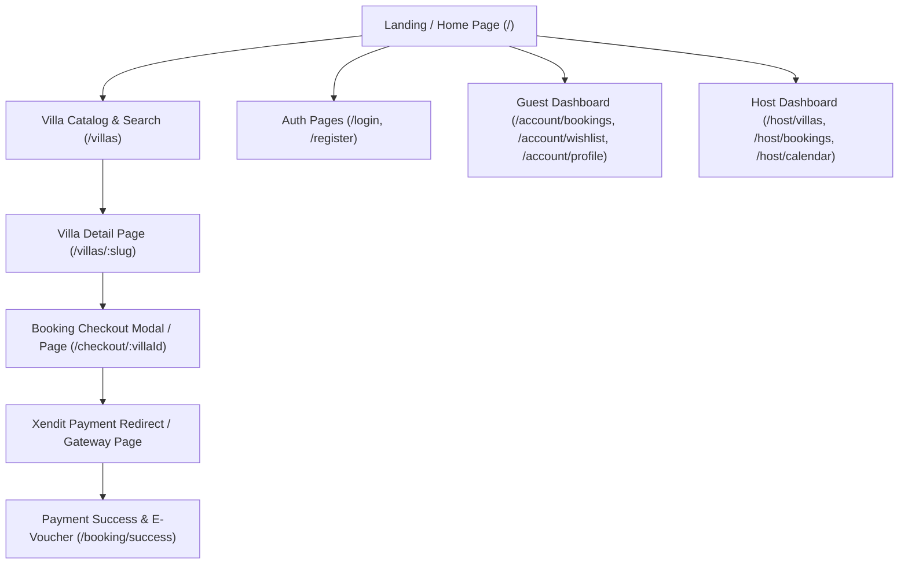

# PRODUCT REQUIREMENTS DOCUMENT (PRD) & FRONTEND GUIDANCE FOR LOVABLE AI
## Project: Balivio — Bali Villa Search, Booking & Host Management Platform

> **Purpose**: This document serves as the master specification and prompt guidance for **Lovable AI** (or any AI frontend builder) to construct the complete, responsive, and luxury frontend web application for **Balivio**, seamlessly integrated with the Balivio Express.js / Supabase / Xendit Backend API.

---

## 1. Project Overview & Vision

- **Application Name**: Balivio
- **Niche / Domain**: Luxury Villa Rental & Booking Platform (Bali, Indonesia)
- **Primary Goal**: Deliver a high-end, responsive, and intuitive web application where guests can search, filter, bookmark, reserve, and pay for villas in Bali, while hosts and admins can manage listings, availability calendars, reservations, and guest reviews.
- **Design Aesthetic**: Premium Luxury Island Vibe. Deep teal/emerald accents (`#0f4c3a`), warm sandy beige neutrals (`#f7f4ef`), sleek dark mode options, soft glassmorphism, subtle micro-animations (Framer Motion), clean modern typography (Inter / Plus Jakarta Sans), and vibrant card UI.
- **Target Audience**:
  - **Guests**: Travelers looking for private, boutique, and luxury villa rentals in Bali.
  - **Hosts**: Villa owners managing listings, pricing, blackout dates, and guest bookings.
  - **Admins**: Platform operators overseeing all bookings and listings.

---

## 2. Technical Stack & Frontend Architecture

When generating the frontend code with Lovable AI, follow this exact tech stack:

- **Framework**: React 18+ with TypeScript (Vite or Next.js App Router)
- **Styling**: Tailwind CSS v3+ with CSS Variables for color tokens
- **UI Components**: `shadcn/ui` (Radix UI primitives: Dialog, DropdownMenu, Tabs, Calendar, Toast/Sonner, Sheet, Slider, Badge, Card, Avatar)
- **Icons**: `lucide-react`
- **State Management**:
  - **Global Auth & User State**: Zustand / React Context (`useAuthStore`)
  - **Server Data Fetching & Caching**: TanStack Query v5 (`@tanstack/react-query`) or SWR
- **Forms & Validation**: `react-hook-form` + `zod`
- **Date Utilities**: `date-fns`
- **Animations**: `framer-motion`
- **HTTP Client**: `axios` or native `fetch` wrapper with automatic JWT Bearer insertion & token refresh interceptors.

---

## 3. Backend API Integration Specifications

### 3.1 Base Configuration
- **API Base URL**: `http://localhost:3001/api/v1` (configurable via `import.meta.env.VITE_API_BASE_URL` or `process.env.NEXT_PUBLIC_API_URL`)
- **Authentication**: JWT Bearer Token stored in `localStorage` or `cookies`. Included in HTTP headers:
  ```http
  Authorization: Bearer <access_token>
  ```

### 3.2 Standard API Response Envelope
All API responses adhere strictly to the following JSON structure:

```typescript
// Success Response Format
interface ApiResponse<T> {
  success: true;
  data: T;
  message: string;
  meta?: {
    page: number;
    limit: number;
    total: number;
    totalPages: number;
  };
}

// Error Response Format
interface ApiErrorResponse {
  success: false;
  data: null;
  message: string;
  errors?: Array<{
    code: string;
    path: (string | number)[];
    message: string;
  }>;
}
```

---

## 4. Database Entities & Types (Matching Backend Schema)

Lovable AI should utilize these TypeScript models for data structures:

```typescript
export type UserRole = 'guest' | 'host' | 'admin';
export type UserStatus = 'active' | 'suspended' | 'unverified';
export type VillaStatus = 'active' | 'inactive' | 'maintenance';
export type BookingStatus = 'pending' | 'confirmed' | 'paid' | 'cancelled' | 'completed';
export type PaymentStatus = 'pending' | 'completed' | 'failed' | 'refunded';
export type PaymentMethod = 'transfer' | 'card' | 'ewallet';
export type AvailabilityStatus = 'available' | 'blocked' | 'booked';

export interface User {
  id: string;
  email: string;
  displayName: string;
  phone?: string;
  role: UserRole;
  status: UserStatus;
  avatarUrl?: string;
  birthDate?: string;
  gender?: string;
  address?: string;
  city?: string;
  country?: string;
  createdAt: string;
}

export interface Area {
  id: number;
  name: string; // e.g. Canggu, Ubud, Uluwatu, Seminyak, Sanur
  region: string; // e.g. Bali
  imageUrl?: string;
  description?: string;
}

export interface PropertyType {
  id: number;
  name: string; // e.g. Private Villa, Boutique Villa, Family Villa, Luxury Villa
  description?: string;
}

export interface Amenity {
  id: number;
  key: string; // e.g. wifi, pool, ac, kitchen, breakfast, beach, parking
  label: string;
  iconName?: string;
  category?: string; // General, Safety, Entertainment, Outdoor
}

export interface VillaImage {
  id: string;
  villaId: string;
  imageUrl: string;
  sortOrder: number;
}

export interface VillaPolicy {
  villaId: string;
  checkInTime: string; // default "14:00"
  checkOutTime: string; // default "12:00"
  cancellationPolicy: string;
  customRules?: string;
}

export interface Villa {
  id: string;
  slug: string;
  name: string;
  description: string;
  propertyTypeId?: number;
  areaId?: number;
  hostId?: string;
  address: string;
  latitude?: number;
  longitude?: number;
  pricePerNight: string; // Numeric decimal string
  originalPrice?: string;
  discountPercent?: number;
  bedrooms: number;
  guestsCapacity: number;
  status: VillaStatus;
  createdAt: string;
  areaName?: string;
  propertyTypeName?: string;
  coverImage?: string;
  images?: VillaImage[];
  amenities?: Amenity[];
  policy?: VillaPolicy;
}

export interface Booking {
  id: string;
  bookingCode: string; // e.g. BK-2026-X8Y1
  villaId: string;
  customerId: string;
  checkIn: string; // YYYY-MM-DD
  checkOut: string; // YYYY-MM-DD
  guestsCount: number;
  subtotal: string;
  serviceFee: string; // 10%
  tax: string; // 11%
  totalPrice: string;
  status: BookingStatus;
  customerName: string;
  customerEmail: string;
  customerPhone: string;
  customerNotes?: string;
  createdAt: string;
  villa?: Villa;
}

export interface Payment {
  id: string;
  bookingId: string;
  paymentCode: string;
  paymentMethod: PaymentMethod;
  amount: string;
  status: PaymentStatus;
  gatewayResponse?: any;
  paidAt?: string;
  createdAt: string;
}

export interface Review {
  id: string;
  bookingId?: string;
  villaId: string;
  userId?: string;
  rating: string; // 1.0 to 5.0
  comment?: string;
  replyFromHost?: string;
  createdAt: string;
  user?: {
    displayName: string;
    avatarUrl?: string;
  };
}

export interface WishlistItem {
  villaId: string;
  createdAt: string;
  villaName: string;
  villaSlug: string;
  pricePerNight: string;
}
```

---

## 5. API Endpoints Map & Contracts

All requests must handle the base URL `/api/v1`:

| Category | Method | Endpoint | Auth Required | Description / Payload |
|---|---|---|---|---|
| **Health** | `GET` | `/health` | No | Server status |
| **Auth** | `POST` | `/auth/register` | No | `{ email, password, displayName, phone? }` |
| **Auth** | `POST` | `/auth/login` | No | `{ email, password }` -> Returns `{ user, session: { accessToken, refreshToken } }` |
| **Auth** | `GET` | `/auth/google` | No | Returns `{ url }` for Google OAuth redirect |
| **Auth** | `POST` | `/auth/refresh` | No | `{ refreshToken }` -> Returns new `accessToken` |
| **Auth** | `POST` | `/auth/logout` | Bearer | Invalidates user session |
| **Auth** | `GET` | `/auth/me` | Bearer | Gets current logged-in user + profile |
| **Users** | `GET` | `/users/profile` | Bearer | Get full profile |
| **Users** | `PUT` | `/users/profile` | Bearer | `{ displayName, phone, avatarUrl, birthDate, gender, address, city, country }` |
| **Users** | `PATCH` | `/users/password` | Bearer | `{ oldPassword, newPassword }` |
| **Master Data**| `GET` | `/areas` | No | List all Bali areas (Ubud, Canggu, etc.) |
| **Master Data**| `GET` | `/property-types` | No | List property categories |
| **Master Data**| `GET` | `/amenities` | No | List facilities grouped by category |
| **Villas** | `GET` | `/villas` | No | Search query params: `area_id`, `property_type_id`, `amenity_ids` (csv), `min_price`, `max_price`, `guests`, `bedrooms`, `check_in`, `check_out`, `sort` (`price_asc`, `price_desc`, `rating_desc`, `newest`), `page`, `limit` |
| **Villas** | `GET` | `/villas/:slug` | No | Full villa detail including images, amenities, policy |
| **Villas** | `GET` | `/villas/:villaId/availability` | No | Params: `start_date`, `end_date` -> Array of `{ date, status: 'available'|'blocked'|'booked' }` |
| **Villas** | `GET` | `/villas/:villaId/reviews` | No | Paginated review list |
| **Villas (Host)**| `POST` | `/villas` | Host/Admin | Create villa listing |
| **Villas (Host)**| `PUT` | `/villas/:villaId` | Host/Admin | Update villa info |
| **Villas (Host)**| `DELETE` | `/villas/:villaId` | Host/Admin | Soft delete villa |
| **Villas (Host)**| `POST` | `/villas/:villaId/images` | Host/Admin | `{ imageUrl, sortOrder }` |
| **Villas (Host)**| `DELETE` | `/villas/:villaId/images/:imageId` | Host/Admin | Delete gallery photo |
| **Villas (Host)**| `PUT` | `/villas/:villaId/availability` | Host/Admin | `{ dates: string[], status: 'available' | 'blocked' }` |
| **Bookings** | `POST` | `/bookings` | Bearer | `{ villaId, checkIn, checkOut, guestsCount, customerName, customerEmail, customerPhone, customerNotes? }` |
| **Bookings** | `GET` | `/bookings` | Bearer | List current guest's bookings |
| **Bookings** | `GET` | `/bookings/:bookingCode` | Bearer | Get specific booking voucher by code (e.g. `BK-2026-X8Y1`) |
| **Bookings** | `PATCH` | `/bookings/:id/cancel` | Bearer | Cancel pending/confirmed booking |
| **Bookings (Host)**| `GET` | `/bookings/host/bookings` | Host/Admin | List reservations for host's villas |
| **Bookings (Host)**| `PATCH` | `/bookings/host/bookings/:id/confirm` | Host/Admin | Host manually confirms pending booking & locks dates |
| **Bookings (Admin)**| `GET` | `/bookings/admin/bookings` | Admin | Master booking list |
| **Payments** | `POST` | `/payments/initiate` | Bearer | `{ bookingId, paymentMethod: 'transfer'|'ewallet'|'card', bankCode? }` -> Returns `{ payment, invoiceUrl, invoiceId }` |
| **Payments** | `GET` | `/payments/:paymentCode` | Bearer | Check payment status |
| **Reviews** | `POST` | `/reviews` | Bearer | `{ bookingId, villaId, rating, comment? }` (only completed bookings) |
| **Reviews (Host)**| `PATCH` | `/reviews/:id/reply` | Host/Admin | `{ replyFromHost }` |
| **Reviews** | `DELETE` | `/reviews/:id` | Bearer | Soft delete review |
| **Wishlists** | `GET` | `/wishlists` | Bearer | List saved wishlist items |
| **Wishlists** | `POST` | `/wishlists/:villaId` | Bearer | Save villa to wishlist |
| **Wishlists** | `DELETE` | `/wishlists/:villaId` | Bearer | Remove villa from wishlist |

---

## 6. Page-by-Page Detailed User Flows & UI Specifications

Lovable AI must construct the following screens and user flows:



---

### Page 1: Landing / Home Page (`/`)
- **Hero Section**:
  - High-resolution background video or luxury villa image carousel.
  - Heading: *"Discover Your Private Sanctuary in Bali"*.
  - Subheading: *"Handpicked luxury villas, instant online booking, and verified local hosts."*
  - **Search Widget**:
    - Location / Area selector dropdown (populated via `GET /api/v1/areas`).
    - Date Range Picker (Check-in & Check-out).
    - Guest count stepper (+ / - buttons).
    - "Search Villas" primary CTA button -> Redirects to `/villas` with prefilled query parameters.
- **Popular Destinations Bar (`GET /api/v1/areas`)**:
  - Horizontal scrolling cards for Canggu, Ubud, Uluwatu, Seminyak, Sanur.
  - Image thumbnail, area title, and region description. Clicking navigates to `/villas?area_id=X`.
- **Featured Villas Section (`GET /api/v1/villas?limit=6&sort=newest`)**:
  - Responsive Grid (3 columns on desktop, 1 on mobile).
  - Villa Card: Cover image badge (e.g. "20% OFF"), Title, Area Name, Bedroom & Guest Capacity badges, Price per night, Wishlist heart button toggle.
- **Why Balivio / Platform Benefits**:
  - Verified Listings, Best Price Guarantee, Instant Booking, 24/7 Local Support.
- **Footer**:
  - Links to About, Contact, Terms of Service, Privacy Policy, Host Registration, Social Media icons.

---

### Page 2: Villa Search Catalog & Filtering (`/villas`)
- **Top Filter & Search Header**:
  - Keyword & Location search input.
  - Quick filter pills (e.g., "Private Pool", "Beachfront", "Under Rp 2,000,000", "4+ Bedrooms").
- **Sidebar Filter Drawer / Sticky Panel**:
  - **Area Filter**: Checkboxes for Canggu, Ubud, Uluwatu, etc.
  - **Property Type Filter**: Checkboxes for Private Villa, Resort, etc.
  - **Price Range Slider**: Min & Max Price per night (IDR).
  - **Guest & Bedroom Count**: Stepper controls.
  - **Date Range Picker**: Filters out unavailable/booked villas.
  - **Amenities Multi-Select**: Checkboxes for WiFi, Pool, AC, Kitchen, Chef, Breakfast, etc.
  - "Reset Filters" and "Apply Filters" buttons.
- **Catalog Toolbar**:
  - Total count indicator (e.g., *"Showing 14 villas in Bali"*).
  - Sort dropdown: `Price: Low to High`, `Price: High to Low`, `Newest Listings`.
- **Villa Grid / List View Toggle**:
  - Displays Villa Cards with smooth hover zoom effects, price badge, original price strikethrough, discount percentage, rating score, and wishlist bookmark button.
- **Pagination Component**:
  - Page numbers (1, 2, 3...) driven by `meta` response object.

---

### Page 3: Villa Detail View (`/villas/:slug`)
- **Image Gallery Showcase**:
  - Grid layout featuring 1 large main image + 4 secondary grid thumbnails.
  - "Show all photos" button launching a full-screen Lightbox Gallery Modal.
- **Header & Quick Info**:
  - Title, Area name, Address, "Save to Wishlist" heart icon button, Share button.
  - Capacity pills: `X Guests` • `Y Bedrooms` • `Property Type`.
- **Content Tabs / Sections**:
  - **Description**: Rich text overview of the villa.
  - **Amenities**: Grid of icon badges grouped by category (General, Safety, Entertainment, Outdoor).
  - **Location & Map**: Address details and static/interactive map view placeholder.
  - **Villa Policies**: Check-in time (e.g., 14:00), Check-out time (12:00), Cancellation Policy, House Rules.
- **Sticky Booking Widget (Right Sidebar)**:
  - Price display: e.g. `Rp 2,500,000 / night` (with original price & discount tag if applicable).
  - Date Range Picker (Check-in to Check-out).
  - Guest count selector dropdown.
  - **Live Price Breakdown Calculation**:
    - `Subtotal` = `Price Per Night * Nights`
    - `Service Fee (10%)` = `Subtotal * 0.10`
    - `Tax (11%)` = `Subtotal * 0.11`
    - `Total Price` = `Subtotal + Service Fee + Tax`
  - "Reserve / Book Now" CTA Button -> Triggers checkout modal or navigates to `/checkout/:villaId`.
- **Reviews & Ratings Section (`GET /api/v1/villas/:villaId/reviews`)**:
  - Average rating score badge (e.g. `4.8 / 5.0`).
  - List of guest review cards: Guest name, Avatar, Rating stars, Date, Comment, Host reply box if present.

---

### Page 4: Booking Checkout (`/checkout/:villaId` or `/booking/create`)
- **Order Summary Sidebar**:
  - Villa thumbnail, Title, Location.
  - Selected Check-in & Check-out dates, Total Nights count, Guest count.
  - Full itemized price breakdown (Subtotal, Service Fee 10%, Tax 11%, Total Amount).
- **Guest Information Form**:
  - Auto-populated if logged in: Full Name, Email Address, Phone Number.
  - Special requests / Notes text area.
- **Payment Method Selection**:
  - **Bank Transfer / Virtual Account** (BCA, BNI, BRI, Mandiri, Permata).
  - **E-Wallet / QRIS** (OVO, DANA, LinkAja, ShopeePay).
  - **Credit / Debit Card**.
- **CTA**: "Confirm Booking & Proceed to Payment" button.
  - Executing logic:
    1. Call `POST /api/v1/bookings` -> returns created `booking` object & `bookingCode`.
    2. Call `POST /api/v1/payments/initiate` with `bookingId` and `paymentMethod`.
    3. Redirect user to Xendit `invoiceUrl` or display Xendit Virtual Account payment details.

---

### Page 5: Payment Success & E-Voucher (`/booking/success`, `/bookings/:bookingCode`)
- **Success Celebration Banner**:
  - Confetti animation, Green checkmark icon.
  - "Booking Confirmed & Paid!" message.
- **Digital E-Voucher Card**:
  - Unique Booking Code badge (e.g., `BK-2026-X8Y1`).
  - QR Code placeholder.
  - Villa Name, Address, Host Contact details.
  - Check-in & Check-out date badges.
  - Download PDF / Print Voucher button.
  - Button to "View My Bookings" or "Return Home".

---

### Page 6: Guest Account & Dashboard (`/account/*`)
- **My Bookings Tab (`/account/bookings`)**:
  - Tabs filtering: `All`, `Upcoming`, `Completed`, `Cancelled`.
  - Booking Cards featuring: Booking Code, Villa thumbnail & title, Stay dates, Total price, Status Badge (`pending`, `confirmed`, `paid`, `completed`, `cancelled`).
  - Action Buttons:
    - "Pay Now" (if `pending` - re-initiates payment).
    - "View E-Voucher" (if `paid` or `confirmed`).
    - "Cancel Reservation" (if `pending` or `confirmed`).
    - "Write Review" button (if `completed` -> opens review modal to submit 1-5 rating & text comment).
- **My Wishlist Tab (`/account/wishlist`)**:
  - Grid of saved villas. "Remove from Wishlist" trash icon button. Click card to view detail.
- **Profile Settings Tab (`/account/profile`)**:
  - Edit Profile Form: Avatar upload/URL, Display Name, Phone Number, Birth Date, Gender, Address, City, Country.
  - Change Password Form: New password, Confirm password.

---

### Page 7: Host & Admin Management Dashboard (`/host/*`)
- **Listing Management (`/host/villas`)**:
  - Table / Card view of host's villas with status indicators (`active`, `inactive`, `maintenance`).
  - "Add New Villa" button (`POST /api/v1/villas`).
  - Actions: Edit Villa Details, Manage Gallery Photos (Upload/Delete), Soft Delete Villa.
- **Gallery Management Modal**:
  - Drag-and-drop / URL input for photo additions.
  - Sort order input. Delete photo button.
- **Availability Calendar Manager (`/host/calendar`)**:
  - Interactive Month Calendar View.
  - Click or drag across dates to select a range.
  - Action modal to toggle dates as `Available` or `Blocked` (`PUT /api/v1/villas/:villaId/availability`).
- **Host Reservations Management (`/host/bookings`)**:
  - Table of guest bookings for host's properties.
  - Action button: "Confirm Booking" (`PATCH /api/v1/bookings/host/bookings/:id/confirm`) which locks calendar dates.
- **Reviews & Feedback Manager**:
  - View guest reviews for host's villas.
  - Inline form to reply to guest reviews (`PATCH /api/v1/reviews/:id/reply`).

---

### Page 8: Authentication Dialogs / Pages (`/login`, `/register`)
- Clean modal or centered card UI.
- Toggle between "Sign In" and "Create Account".
- **Email & Password Form** with validation feedback.
- **Google OAuth SSO Button**: Calls `GET /api/v1/auth/google`, receives redirect URL, and opens Google OAuth consent.
- Automatic storage of JWT access token and user role in global state (`useAuthStore`).

---

## 7. Crucial Technical Rules for Lovable AI

1. **State Hydration & Token Refresh**:
   - On app startup, inspect `localStorage` for `accessToken` and `refreshToken`.
   - Call `GET /api/v1/auth/me` to restore the user session.
   - Attach an Axios/Fetch response interceptor: If an API request returns `401 Unauthorized`, automatically attempt `POST /api/v1/auth/refresh` using the stored `refreshToken`. If successful, retry the original request. If refresh fails, clear tokens and redirect to `/login`.

2. **Price & Currency Formatting**:
   - Always format prices using Indonesian Rupiah (`IDR`) standard:
     ```typescript
     export const formatIDR = (amount: number | string) => {
       const num = typeof amount === 'string' ? parseFloat(amount) : amount;
       return new Intl.NumberFormat('id-ID', {
         style: 'currency',
         currency: 'IDR',
         maximumFractionDigits: 0,
       }).format(num);
     };
     // Example output: "Rp 2.500.000"
     ```

3. **Date Calculations & Validation**:
   - Use `date-fns` for checking minimum stay (check-out must be at least 1 day after check-in).
   - Ensure date formats sent to the backend query parameters match `YYYY-MM-DD`.

4. **Role Guards & Route Protection**:
   - Protect `/checkout`, `/account/*` routes for authenticated users (`guest`, `host`, `admin`).
   - Protect `/host/*` routes specifically for users with `host` or `admin` roles.

5. **Toast Notifications & Error Handling**:
   - Use `sonner` or `shadcn/ui toast` to display friendly error messages returned by API validation (`errors` array or `message` string).

---

## 8. Summary Checklist for Lovable AI Build

- [x] Configure Base Axios / Fetch client pointing to `/api/v1` with Bearer token header.
- [x] Implement Zustand Auth Store (`user`, `accessToken`, `refreshToken`, `login`, `logout`).
- [x] Create Navigation Bar with Logo, Search, Currency/Language, Host Link, Wishlist badge, User Avatar menu.
- [x] Build Landing Page (`/`) with Hero Search, Destination Cards, Featured Villas, Platform Perks.
- [x] Build Villa Catalog (`/villas`) with Sidebar Filters, Sorting, Grid Cards, Pagination.
- [x] Build Villa Detail (`/villas/:slug`) with Image Lightbox, Amenity Icons, Policy Cards, Reviews List, Sticky Price Breakdown Booking Widget.
- [x] Build Booking Checkout Flow (`/checkout/:villaId`) with Itemized Pricing, Guest Form, Xendit Payment Integration.
- [x] Build Payment Success E-Voucher Screen (`/booking/success`).
- [x] Build Guest Dashboard (`/account/bookings`, `/account/wishlist`, `/account/profile`).
- [x] Build Host Dashboard (`/host/villas`, `/host/calendar`, `/host/bookings`).